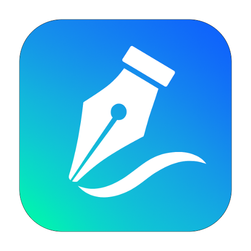

# Inkference

**Build your portfolio. Plan your work. Find your people.**

&nbsp;

&nbsp;

---

> [!CAUTION]
> ### 👀 Look, don't take
> This repository is public **so people can see my work**. It is **not** open source.
>
> - ❌ No copying, reusing, or adapting this code (in whole or in part)
> - ❌ No cloning this project, its design, or its features into another product
> - ❌ No redistributing, reselling, or hosting your own copy
> - ✅ You **can** read the code, browse it, and use the live site at [inkference.app](https://inkference.app)
>
> All rights reserved. See [LICENSE](LICENSE). Want to use something? Ask first: **inkference@gmail.com**

---

## ✨ What is Inkference?

Inkference is a portfolio **and** social platform for builders. Instead of a boring resume, you get a living profile that shows what you've built, what you know, and what you're up to, and a feed to share it with people who care.

<table>
<tr>
<td width="50%" valign="top">

### 🗂️ Portfolio
- **Projects** with banners, galleries, links, resources, skills and contributors
- **Experience, education and merits** on a clean timeline
- **Skills** that link across your projects and experience
- **Photo galleries** with crop, reorder and lazy loading

</td>
<td width="50%" valign="top">

### 💬 Social
- **Home feed** with "For you" and "Following", infinite scroll, unseen posts first
- **Posts** with multi-photo carousels, likes, saves and comments
- **Friends and followers**, suggested builders, and trending posts
- **Explore** search for people, posts and projects

</td>
</tr>
<tr>
<td width="50%" valign="top">

### 🔔 Notifications
- In-app and **push notifications** (even on your phone's home screen)
- Smart grouping, so 20 likes become one notification
- Choose exactly which notifications you get

</td>
<td width="50%" valign="top">

### 🔒 Privacy
- Per-post and per-project **visibility**: public, followers, friends, custom or private
- **Block** people and hide content from specific users
- Every server action checks who you are and what you own

</td>
</tr>
<tr>
<td width="50%" valign="top">

### 🗓️ Productivity
- **Planners** with Board, Week and Month views on real dates
- Drag cards between days, add times, see everything **overdue**
- **To-dos** with Today, Upcoming and Important lists

</td>
<td width="50%" valign="top">

### 🗃️ Drive
- **Notes** that save as you type, pinned and searchable
- Private to you
- Docs and sheets coming soon

</td>
</tr>
</table>

## 🛠️ Built with

| Layer | Tech |
| --- | --- |
| Framework | Next.js 16 (App Router, Server Actions, Turbopack), React 19 |
| Language | TypeScript |
| Styling | Tailwind CSS 4, shadcn/ui, Lucide icons |
| Data | PostgreSQL (Supabase) + Prisma 7 |
| Auth | Better Auth (email, password and linked accounts) |
| Media | Cloudinary with on-the-fly resizing |
| Client data | TanStack Query |
| App | Installable PWA (Serwist) with Web Push |
| SEO | Sitemap, robots, canonical URLs and JSON-LD structured data |
| Hosting | Render |

## 🚀 Highlights under the hood

- **Fast images everywhere:** thumbnails load tiny previews first, then fade in the full photo. Only nearby carousel photos are downloaded.
- **Client-side cropping:** photos are cropped and shrunk in the browser before upload, so posting is quick even on mobile data.
- **Privacy engine:** one shared set of rules decides who can see what, used by the feed, search, profiles and the sitemap.
- **Installable app:** works like a native app on phones, with offline support and push notifications.
- **Search ready:** public profiles, posts, projects and galleries are indexed by Google with rich previews.

## 📬 Contact

Questions, feedback, or want permission to use something?
📧 **inkference@gmail.com** &nbsp;·&nbsp; 🌐 **[inkference.app](https://inkference.app)**

---

**© 2026 cchryx. All rights reserved.**
 
Made with ☕ and a lot of late nights.

